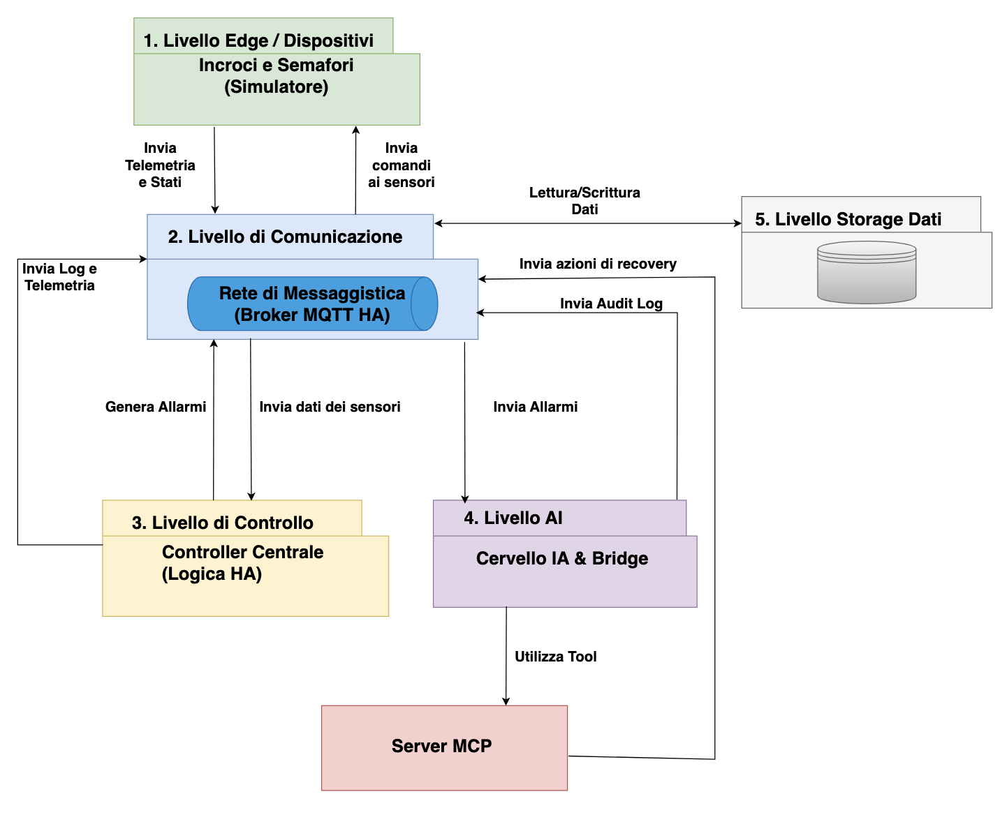

# 🚦 SRS: Smart Road System
**Un'architettura IoT resiliente con Intelligenza Artificiale Agentica per la gestione del traffico urbano.**

---

## 💡 L'Idea alla Base
L'obiettivo del progetto SRS (Smart Road System) è superare i limiti dei tradizionali sistemi di controllo semaforico, che spesso si rivelano fragili di fronte a guasti o picchi di traffico. 

Abbiamo progettato un'infrastruttura distribuita ad **Alta Affidabilità (HA)** in grado di resistere a crash software, partizioni di rete e guasti hardware applicando i principi della **Graceful Degradation** e testandoli tramite *Chaos Engineering*. L'innovazione principale risiede nell'integrazione di un livello di **Intelligenza Artificiale Agentica** (basata su protocollo MCP). L'IA non gestisce il normale scorrere del tempo, ma interviene in modo asincrono solo per risolvere colli di bottiglia (code di traffico) o tentare il ripristino automatico dei nodi guasti (*Self-Healing*). Tutte le azioni dell'IA sono confinate da rigidi *guardrails* di sicurezza per impedire comportamenti non deterministici o dannosi.

---

## 🏗️ Come lo abbiamo sviluppato (Architettura Generale)

Il sistema è stato ingegnerizzato seguendo un'architettura a microservizi divisa in 5 livelli logici, progettati per non avere alcun *Single Point of Failure* (SPOF).



1. **Livello Edge / Dispositivi:** I nodi semaforici fisici (qui implementati tramite un simulatore Python). Ogni nodo ha una logica di base autonoma: se perde la connessione o subisce un guasto, scala in sicurezza attivando il giallo lampeggiante (Graceful Degradation).
2. **Livello di Comunicazione:** Un robusto cluster MQTT (EMQX) bilanciato da HAProxy. Garantisce la consegna dei messaggi (telemetria, heartbeat, comandi) anche in caso di caduta di uno dei broker.
3. **Livello di Controllo:** Controller centralizzati configurati in modalità *Active/Standby*. Tramite un cluster Redis, i controller eleggono un Leader (Leader Election). Se il Leader muore, lo Standby prende il controllo evitando lo *Split-Brain*.
4. **Livello AI:** Il "Cervello" del sistema (OpenCode/LiteLLM) interfacciato tramite un Bridge in Python. Agenti e Sub-agenti analizzano gli allarmi e prendono decisioni complesse di ottimizzazione o riparazione.
5. **Livello Storage Dati & Server MCP:** Lo strato di persistenza usa InfluxDB in *Dual-Write* per garantire la continuità dei log e delle metriche storiche. I **Server MCP** espongono i tool (le "braccia") dell'IA, permettendole di leggere lo stato del traffico e inviare comandi di *recovery* in totale sicurezza.

---

## ⚙️ Configurazione API (Fondamentale)

Per abilitare le funzionalità di intelligenza artificiale (ottimizzazione e recovery), è necessario configurare le chiavi API di Gemini.

1. Apri i file di configurazione degli agenti:
   * `opencode/opencode_a.json`
   * `opencode/opencode_b.json`
2. Individua il campo `apiKey` all'interno dell'oggetto `options` nel provider `litellm`.
3. Inserisci una **API Key di Gemini valida**. Senza questa chiave, gli agenti non saranno in grado di elaborare i prompt e restituiranno errori di connessione.

---

## 🚀 Deploy e Avvio Rapido

Il sistema è interamente containerizzato. Per avviare l'intera infrastruttura (database, broker, AI, controller e simulatori) è sufficiente avere Docker installato.

### 1. Avviare il sistema
Esegui questo comando nella root del progetto:
```bash
docker compose up --build -d
``` 
### 2. Accesso alla Simulazione
Per visualizzare e interagire con la rete semaforica:

Apri il browser all'indirizzo: http://localhost:8080.  

Clicca sul pulsante "Avvia Simulazione" per attivare il flusso di dati e la logica dei controller.

### 3. Monitorare i Log
Una volta avviato, i servizi saranno raggiungibili per il monitoraggio sulle seguenti porte locali:

* Portainer (Gestione Container): http://localhost:9443
* Dozzle (Visualizzazione Log in tempo reale): http://localhost:8888

### 4. Interazione e Scenari di Test
Dalla dashboard della simulazione è possibile testare la resilienza del sistema tramite diverse azioni:

**Azioni Dirette sui Nodi**
* **Iniezione di Traffico**: Inserimento manuale di un numero arbitrario di auto su una specifica direzione di un incrocio per testare l'ottimizzazione dell'IA.

* **Crash Software**: Simulazione di un guasto critico su un semaforo per attivare le procedure di Graceful Degradation (Giallo lampeggiante di sicurezza) e il successivo intervento del Recovery Agent.

**Scenari Complessi**
È possibile attivare scenari predefiniti per valutare il sistema sotto stress:

* **Scenario Tsunami / Apocalisse**: Questo scenario genera un carico massiccio e casuale su tutta la rete. Per ogni incrocio censito, vengono iniettate tra le 40 e le 80 auto in direzioni casuali (Nord o Est) con ritardi sequenziali, simulando una congestione totale della griglia urbana.


### 5. Analisi dei Dati e Grafana
Il sistema include una dashboard personalizzata per monitorare in tempo reale le decisioni dell'IA e lo stato del traffico.

* **Accedi a Grafana**: http://localhost:3000 (User: admin / Pass: admin).  

* **Importante**: Per visualizzare i dati correttamente, importa il template JSON della dashboard che trovi nella cartella di progetto: /dashboard_grafana/dashboard-1778683765057.json

* La dashboard mostrerà i grafici relativi all'Agent Audit (decisioni prese dall'IA) e allo stato della telemetria inviata dai nodi edge.

### 6. Spegnere il sistema
Per fermare e rimuovere i container, esegui:
```bash
docker compose down
```
